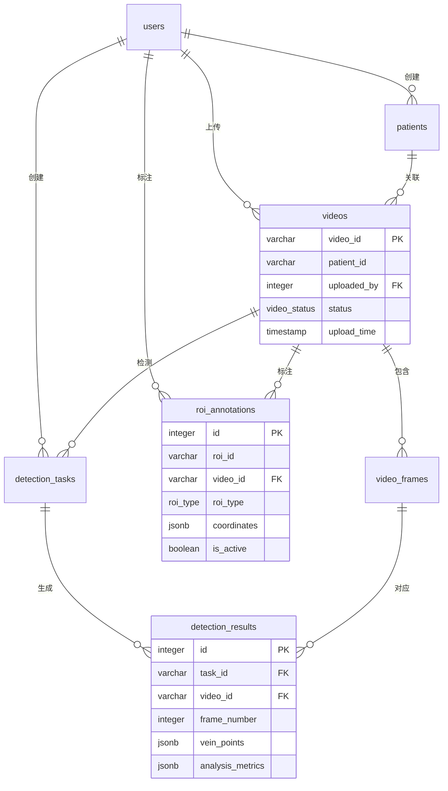

# 静脉检测系统数据库设计文档

## 概述

本文档详细描述了静脉检测系统的数据库架构设计，包括表结构、关系、索引、约束和优化策略。

## 数据库架构

### 技术栈

- **数据库引擎**: PostgreSQL 13+
- **缓存层**: Redis 6+
- **存储类型**: 对象存储 (MinIO/S3)
- **全文搜索**: PostgreSQL GIN索引 + tsvector

### 设计原则

1. **规范化**: 遵循第三范式，避免数据冗余
2. **性能优化**: 针对查询模式设计索引
3. **扩展性**: 支持水平扩展和分区
4. **安全性**: 行级安全 (RLS) 和数据加密
5. **审计性**: 完整的操作日志记录

## 数据库结构

### 用户管理模块

#### users - 用户表
```sql
CREATE TABLE users (
    id SERIAL PRIMARY KEY,
    username VARCHAR(50) UNIQUE NOT NULL,
    email VARCHAR(100) UNIQUE NOT NULL,
    password_hash VARCHAR(255) NOT NULL,
    full_name VARCHAR(100),
    role user_role DEFAULT 'viewer',
    department VARCHAR(50),
    license_number VARCHAR(50),
    is_active BOOLEAN DEFAULT true,
    last_login_at TIMESTAMP,
    created_at TIMESTAMP DEFAULT CURRENT_TIMESTAMP,
    updated_at TIMESTAMP DEFAULT CURRENT_TIMESTAMP
);
```

**字段说明**:
- `id`: 用户唯一标识
- `username`: 用户名（唯一）
- `email`: 邮箱地址（唯一）
- `password_hash`: 密码哈希值
- `full_name`: 真实姓名
- `role`: 用户角色（admin/doctor/operator/viewer）
- `department`: 所属部门
- `license_number`: 执业证书编号
- `is_active`: 账户是否激活
- `last_login_at`: 最后登录时间

**索引**:
- `idx_users_username`: username唯一索引
- `idx_users_email`: email唯一索引
- `idx_users_role`: role查询索引
- `idx_users_is_active`: 活跃用户筛选

### 患者管理模块

#### patients - 患者信息表
```sql
CREATE TABLE patients (
    id SERIAL PRIMARY KEY,
    patient_id VARCHAR(20) UNIQUE NOT NULL,
    name VARCHAR(100) NOT NULL,
    age INTEGER,
    gender VARCHAR(10),
    date_of_birth DATE,
    medical_history TEXT,
    contact_info JSONB,
    created_at TIMESTAMP DEFAULT CURRENT_TIMESTAMP,
    updated_at TIMESTAMP DEFAULT CURRENT_TIMESTAMP
);
```

**字段说明**:
- `patient_id`: 患者编号（脱敏处理）
- `name`: 患者姓名
- `age`: 年龄
- `gender`: 性别
- `date_of_birth`: 出生日期
- `medical_history`: 医疗历史
- `contact_info`: 联系信息（JSON格式）

**索引**:
- `idx_patients_patient_id`: 患者编号索引
- `idx_patients_name`: 患者姓名索引

### 视频管理模块

#### videos - 视频主表
```sql
CREATE TABLE videos (
    id SERIAL PRIMARY KEY,
    video_id VARCHAR(30) UNIQUE DEFAULT generate_video_id(),
    filename VARCHAR(255) NOT NULL,
    original_filename VARCHAR(255),
    file_size BIGINT,
    file_path TEXT NOT NULL,
    storage_url TEXT,
    duration DECIMAL(10,2),
    fps DECIMAL(5,2),
    resolution VARCHAR(20),
    codec VARCHAR(50),
    patient_id VARCHAR(20),
    uploaded_by INTEGER REFERENCES users(id),
    patient_info_id INTEGER REFERENCES patients(id),
    status video_status DEFAULT 'uploaded',
    upload_time TIMESTAMP DEFAULT CURRENT_TIMESTAMP,
    processing_start_time TIMESTAMP,
    processing_end_time TIMESTAMP,
    description TEXT,
    video_metadata JSONB,
    search_vector tsvector,
    created_at TIMESTAMP DEFAULT CURRENT_TIMESTAMP,
    updated_at TIMESTAMP DEFAULT CURRENT_TIMESTAMP
);
```

**字段说明**:
- `video_id`: 视频唯一标识
- `filename`: 存储文件名
- `original_filename`: 原始文件名
- `file_size`: 文件大小（字节）
- `file_path`: 存储路径
- `storage_url`: 存储服务URL
- `duration`: 视频时长（秒）
- `fps`: 帧率
- `resolution`: 分辨率
- `codec`: 编码格式
- `status`: 处理状态
- `video_metadata`: 视频元数据（JSON）

**索引**:
- `idx_videos_video_id`: 视频ID索引
- `idx_videos_patient_id`: 患者关联索引
- `idx_videos_status`: 状态查询索引
- `idx_videos_upload_time`: 上传时间排序
- `idx_videos_search_vector`: 全文搜索索引

#### video_frames - 视频帧表
```sql
CREATE TABLE video_frames (
    id SERIAL PRIMARY KEY,
    video_id VARCHAR(30) REFERENCES videos(video_id) ON DELETE CASCADE,
    frame_number INTEGER NOT NULL,
    timestamp DECIMAL(10,3),
    frame_path TEXT NOT NULL,
    frame_url TEXT,
    width INTEGER,
    height INTEGER,
    file_size BIGINT,
    quality_score DECIMAL(3,2),
    is_key_frame BOOLEAN DEFAULT false,
    created_at TIMESTAMP DEFAULT CURRENT_TIMESTAMP
);
```

**索引**:
- `idx_video_frames_video_id`: 视频关联索引
- `idx_video_frames_frame_number`: 帧号索引
- `idx_video_frames_video_frame`: 复合索引

### 检测模块

#### detection_tasks - 检测任务表
```sql
CREATE TABLE detection_tasks (
    id SERIAL PRIMARY KEY,
    task_id VARCHAR(50) UNIQUE NOT NULL,
    video_id VARCHAR(30) REFERENCES videos(video_id) ON DELETE CASCADE,
    frame_numbers INTEGER[],
    algorithm VARCHAR(20) DEFAULT 'advanced',
    parameters JSONB,
    status detection_status DEFAULT 'pending',
    started_at TIMESTAMP,
    completed_at TIMESTAMP,
    error_message TEXT,
    total_frames INTEGER,
    processed_frames INTEGER DEFAULT 0,
    created_by INTEGER REFERENCES users(id),
    created_at TIMESTAMP DEFAULT CURRENT_TIMESTAMP,
    updated_at TIMESTAMP DEFAULT CURRENT_TIMESTAMP
);
```

**字段说明**:
- `task_id`: 任务唯一标识
- `frame_numbers`: 待检测帧号数组
- `algorithm`: 检测算法版本
- `parameters`: 算法参数配置
- `total_frames`: 总帧数
- `processed_frames`: 已处理帧数

#### detection_results - 检测结果表
```sql
CREATE TABLE detection_results (
    id SERIAL PRIMARY KEY,
    task_id VARCHAR(50) REFERENCES detection_tasks(task_id) ON DELETE CASCADE,
    video_id VARCHAR(30) REFERENCES videos(video_id) ON DELETE CASCADE,
    frame_number INTEGER NOT NULL,
    vein_points JSONB,
    vein_paths JSONB,
    confidence_scores JSONB,
    analysis_metrics JSONB,
    annotated_image_path TEXT,
    annotated_image_url TEXT,
    processing_time DECIMAL(8,3),
    algorithm_version VARCHAR(20),
    created_at TIMESTAMP DEFAULT CURRENT_TIMESTAMP
);
```

**字段说明**:
- `vein_points`: 静脉关键点坐标和置信度
- `vein_paths`: 静脉路径信息
- `confidence_scores`: 置信度分数
- `analysis_metrics`: 分析指标（清晰度、对比度等）
- `processing_time`: 处理耗时

### ROI管理模块

#### roi_annotations - ROI标注表
```sql
CREATE TABLE roi_annotations (
    id SERIAL PRIMARY KEY,
    roi_id VARCHAR(50) NOT NULL,
    video_id VARCHAR(30) REFERENCES videos(video_id) ON DELETE CASCADE,
    frame_number INTEGER NOT NULL,
    roi_type roi_type NOT NULL,
    coordinates JSONB NOT NULL,
    label VARCHAR(100) NOT NULL,
    description TEXT,
    priority INTEGER DEFAULT 5,
    properties JSONB,
    is_active BOOLEAN DEFAULT true,
    created_by INTEGER REFERENCES users(id),
    created_at TIMESTAMP DEFAULT CURRENT_TIMESTAMP,
    updated_at TIMESTAMP DEFAULT CURRENT_TIMESTAMP
);
```

**字段说明**:
- `roi_id`: ROI唯一标识
- `roi_type`: ROI类型（vein_region/reference_point/exclusion_area）
- `coordinates`: 坐标信息（x, y, width, height）
- `priority`: 优先级（1-10）
- `properties`: 扩展属性

#### roi_history - ROI历史表
```sql
CREATE TABLE roi_history (
    id SERIAL PRIMARY KEY,
    roi_id VARCHAR(50) NOT NULL,
    video_id VARCHAR(30) REFERENCES videos(video_id) ON DELETE CASCADE,
    frame_number INTEGER NOT NULL,
    action VARCHAR(20) NOT NULL,
    old_values JSONB,
    new_values JSONB,
    changed_by INTEGER REFERENCES users(id),
    change_reason TEXT,
    created_at TIMESTAMP DEFAULT CURRENT_TIMESTAMP
);
```

### 系统管理模块

#### system_config - 系统配置表
```sql
CREATE TABLE system_config (
    id SERIAL PRIMARY KEY,
    config_key VARCHAR(100) UNIQUE NOT NULL,
    config_value JSONB NOT NULL,
    description TEXT,
    is_editable BOOLEAN DEFAULT true,
    created_by INTEGER REFERENCES users(id),
    created_at TIMESTAMP DEFAULT CURRENT_TIMESTAMP,
    updated_at TIMESTAMP DEFAULT CURRENT_TIMESTAMP
);
```

#### audit_logs - 审计日志表
```sql
CREATE TABLE audit_logs (
    id SERIAL PRIMARY KEY,
    user_id INTEGER REFERENCES users(id),
    action VARCHAR(50) NOT NULL,
    table_name VARCHAR(50),
    record_id INTEGER,
    old_values JSONB,
    new_values JSONB,
    ip_address INET,
    user_agent TEXT,
    created_at TIMESTAMP DEFAULT CURRENT_TIMESTAMP
);
```

## 视图和索引

### 性能优化视图

#### video_overview - 视频概览视图
```sql
CREATE VIEW video_overview AS
SELECT 
    v.video_id,
    v.filename,
    v.patient_id,
    v.duration,
    v.fps,
    v.resolution,
    v.status,
    v.upload_time,
    u.full_name as uploaded_by_name,
    COUNT(DISTINCT vf.id) as total_frames,
    COUNT(DISTINCT dr.id) as detection_results_count,
    COUNT(DISTINCT ra.id) as roi_count
FROM videos v
LEFT JOIN users u ON v.uploaded_by = u.id
LEFT JOIN video_frames vf ON v.video_id = vf.video_id
LEFT JOIN detection_results dr ON v.video_id = dr.video_id
LEFT JOIN roi_annotations ra ON v.video_id = ra.video_id AND ra.is_active = true
GROUP BY v.video_id, v.filename, v.patient_id, v.duration, v.fps, v.resolution, v.status, v.upload_time, u.full_name;
```

#### detection_task_overview - 检测任务概览视图
```sql
CREATE VIEW detection_task_overview AS
SELECT 
    dt.task_id,
    dt.video_id,
    v.filename,
    dt.algorithm,
    dt.status,
    dt.total_frames,
    dt.processed_frames,
    dt.started_at,
    dt.completed_at,
    u.full_name as created_by_name,
    ROUND((dt.processed_frames::decimal / NULLIF(dt.total_frames, 0)) * 100, 2) as progress_percentage
FROM detection_tasks dt
JOIN videos v ON dt.video_id = v.video_id
LEFT JOIN users u ON dt.created_by = u.id;
```

### 索引优化策略

#### 复合索引
```sql
-- 视频查询优化
CREATE INDEX idx_videos_patient_status ON videos(patient_id, status);
CREATE INDEX idx_videos_upload_user ON videos(uploaded_by, upload_time);

-- 检测结果查询优化
CREATE INDEX idx_detection_results_video_frame ON detection_results(video_id, frame_number);

-- ROI查询优化
CREATE INDEX idx_roi_annotations_video_frame_active ON roi_annotations(video_id, frame_number) WHERE is_active = true;
```

#### 部分索引
```sql
-- 活跃用户索引
CREATE INDEX idx_users_active ON users(username) WHERE is_active = true;

-- 已完成检测任务索引
CREATE INDEX idx_detection_tasks_completed ON detection_tasks(video_id, completed_at) WHERE status = 'completed';
```

#### 函数索引
```sql
-- JSON字段索引
CREATE INDEX idx_videos_metadata_processing ON videos USING gin((video_metadata->'processing'));

-- 搜索向量索引
CREATE INDEX idx_videos_search_vector ON videos USING gin(search_vector);
```

## 数据关系图



## 性能优化策略

### 查询优化

#### 1. 分页查询
```sql
-- 高效分页查询
SELECT * FROM videos 
WHERE upload_time < $1 
ORDER BY upload_time DESC 
LIMIT $2 OFFSET $3;

-- 使用游标分页（大数据集）
SELECT * FROM videos 
WHERE video_id > $1 
ORDER BY video_id 
LIMIT $2;
```

#### 2. 连接优化
```sql
-- 使用JOIN避免子查询
SELECT v.video_id, v.filename, COUNT(dr.id) as result_count
FROM videos v
LEFT JOIN detection_results dr ON v.video_id = dr.video_id
GROUP BY v.video_id, v.filename;
```

#### 3. 聚合查询优化
```sql
-- 使用物化视图缓存聚合结果
CREATE MATERIALIZED VIEW video_stats AS
SELECT 
    v.video_id,
    COUNT(DISTINCT vf.id) as frame_count,
    COUNT(DISTINCT dr.id) as result_count,
    AVG(dr.processing_time) as avg_processing_time
FROM videos v
LEFT JOIN video_frames vf ON v.video_id = vf.video_id
LEFT JOIN detection_results dr ON v.video_id = dr.video_id
GROUP BY v.video_id;

-- 定期刷新物化视图
REFRESH MATERIALIZED VIEW CONCURRENTLY video_stats;
```

### 存储优化

#### 1. 表分区
```sql
-- 按时间分区视频表
CREATE TABLE videos_partitioned (
    LIKE videos INCLUDING ALL
) PARTITION BY RANGE (upload_time);

-- 创建月度分区
CREATE TABLE videos_202311 PARTITION OF videos_partitioned
FOR VALUES FROM ('2023-11-01') TO ('2023-12-01');
```

#### 2. 压缩策略
```sql
-- 启用表压缩
ALTER TABLE videos SET (autovacuum_vacuum_scale_factor = 0.1);
ALTER TABLE detection_results SET (fillfactor = 90);
```

### 缓存策略

#### 1. Redis缓存
```python
# 常用查询结果缓存
CACHE_KEYS = {
    'video_overview': 'video:overview:{patient_id}',
    'detection_stats': 'detection:stats:{video_id}',
    'user_permissions': 'user:perms:{user_id}'
}

# 缓存失效策略
CACHE_TTL = {
    'video_data': 3600,      # 1小时
    'detection_results': 1800, # 30分钟
    'user_session': 7200     # 2小时
}
```

#### 2. 应用层缓存
```python
# 使用缓存装饰器
@cached(timeout=3600)
def get_video_overview(patient_id: str):
    # 查询逻辑
    pass

@cached(timeout=1800, key='video:{video_id}')
def get_detection_results(video_id: str):
    # 查询逻辑
    pass
```

## 数据安全

### 访问控制

#### 1. 行级安全 (RLS)
```sql
-- 启用行级安全
ALTER TABLE videos ENABLE ROW LEVEL SECURITY;

-- 创建策略：用户只能访问自己的数据
CREATE POLICY video_access_policy ON videos
    FOR ALL TO application_role
    USING (
        uploaded_by = current_setting('app.current_user_id')::integer
        OR current_setting('app.user_role') = 'admin'
    );
```

#### 2. 数据加密
```sql
-- 敏感字段加密
CREATE EXTENSION IF NOT EXISTS pgcrypto;

-- 患者信息加密存储
CREATE OR REPLACE FUNCTION encrypt_patient_data(data text)
RETURNS bytea AS $$
BEGIN
    RETURN pgp_sym_encrypt(data, current_setting('app.encryption_key'));
END;
$$ LANGUAGE plpgsql;
```

### 审计跟踪

#### 1. 自动审计日志
```sql
-- 创建审计触发器
CREATE OR REPLACE FUNCTION audit_trigger_function()
RETURNS TRIGGER AS $$
BEGIN
    INSERT INTO audit_logs (
        user_id, action, table_name, record_id,
        old_values, new_values, ip_address
    ) VALUES (
        current_setting('app.current_user_id')::integer,
        TG_OP,
        TG_TABLE_NAME,
        COALESCE(NEW.id, OLD.id),
        CASE WHEN TG_OP = 'DELETE' THEN row_to_json(OLD) ELSE NULL END,
        CASE WHEN TG_OP IN ('INSERT', 'UPDATE') THEN row_to_json(NEW) ELSE NULL END,
        inet_client_addr()
    );
    
    RETURN COALESCE(NEW, OLD);
END;
$$ LANGUAGE plpgsql;

-- 为关键表添加审计触发器
CREATE TRIGGER audit_videos_trigger
    AFTER INSERT OR UPDATE OR DELETE ON videos
    FOR EACH ROW EXECUTE FUNCTION audit_trigger_function();
```

#### 2. 数据变更记录
```sql
-- 创建变更历史表
CREATE TABLE data_change_history (
    id SERIAL PRIMARY KEY,
    table_name VARCHAR(50) NOT NULL,
    record_id INTEGER NOT NULL,
    action VARCHAR(20) NOT NULL,
    changed_fields JSONB,
    changed_by INTEGER REFERENCES users(id),
    change_reason TEXT,
    created_at TIMESTAMP DEFAULT CURRENT_TIMESTAMP
);
```

## 备份与恢复

### 备份策略

#### 1. 全量备份
```bash
#!/bin/bash
# 全量备份脚本
BACKUP_DIR="/backups/$(date +%Y%m%d)"
mkdir -p $BACKUP_DIR

# 数据库备份
pg_dump -h $DB_HOST -U $DB_USER -d vein_detection \
    --format=custom \
    --verbose \
    --file="$BACKUP_DIR/database_$(date +%Y%m%d_%H%M%S).dump"

# 压缩备份
gzip "$BACKUP_DIR"/*.dump
```

#### 2. 增量备份
```bash
#!/bin/bash
# WAL日志归档
WAL_DIR="/backups/wal/$(date +%Y%m%d)"
mkdir -p $WAL_DIR

# 配置WAL归档
archive_command = 'cp %p /backups/wal/%f'
archive_mode = on
wal_level = replica
```

### 恢复策略

#### 1. 点时间恢复
```bash
#!/bin/bash
# PITR恢复脚本
RECOVERY_TARGET_TIME="2025-11-18 10:30:00"

# 停止PostgreSQL
systemctl stop postgresql

# 恢复基础备份
rm -rf /var/lib/postgresql/data/*
tar -xzf /backups/base_backup.tar.gz -C /var/lib/postgresql/data/

# 配置恢复参数
cat >> /var/lib/postgresql/data/postgresql.conf << EOF
recovery_target_time = '$RECOVERY_TARGET_TIME'
restore_command = 'cp /backups/wal/%f %p'
EOF

# 启动PostgreSQL
systemctl start postgresql
```

## 监控与维护

### 监控指标

#### 1. 数据库性能指标
```sql
-- 监控慢查询
SELECT query, mean_time, calls 
FROM pg_stat_statements 
ORDER BY mean_time DESC 
LIMIT 10;

-- 监控表大小
SELECT schemaname, tablename, 
       pg_size_pretty(pg_total_relation_size(schemaname||'.'||tablename)) as size
FROM pg_tables 
ORDER BY pg_total_relation_size(schemaname||'.'||tablename) DESC;

-- 监控索引使用情况
SELECT schemaname, tablename, indexname, idx_scan, idx_tup_read, idx_tup_fetch
FROM pg_stat_user_indexes
ORDER BY idx_scan DESC;
```

#### 2. 连接池监控
```sql
-- 监控活动连接
SELECT count(*) as active_connections,
       count(*) FILTER (WHERE state = 'idle') as idle_connections
FROM pg_stat_activity;

-- 监控锁等待
SELECT query, mode, granted
FROM pg_locks l
JOIN pg_stat_activity a ON l.pid = a.pid
WHERE NOT granted;
```

### 维护任务

#### 1. 自动维护脚本
```bash
#!/bin/bash
# 数据库维护脚本

# 清理旧数据
psql -h $DB_HOST -U $DB_USER -d vein_detection -c "
    DELETE FROM audit_logs WHERE created_at < NOW() - INTERVAL '1 year';
    DELETE FROM roi_history WHERE created_at < NOW() - INTERVAL '6 months';
    DELETE FROM detection_results WHERE created_at < NOW() - INTERVAL '3 months' AND status = 'archived';
"

# 重建索引
psql -h $DB_HOST -U $DB_USER -d vein_detection -c "REINDEX DATABASE vein_detection;"

# 更新统计信息
psql -h $DB_HOST -U $DB_USER -d vein_detection -c "ANALYZE;"

# 清理碎片
psql -h $DB_HOST -U $DB_USER -d vein_detection -c "VACUUM FULL;"
```

#### 2. 定时任务
```bash
# 添加到crontab
# 0 2 * * * /path/to/maintenance.sh
# 0 */6 * * * /path/to/backup.sh
# 0 0 * * 0 /path/to/weekly_cleanup.sh
```

## 扩展性设计

### 水平扩展

#### 1. 读写分离
```sql
-- 主从配置
-- 主库：写操作
-- 从库：读操作（报表、统计）

-- 设置只读连接
SET transaction_read_only = on;
```

#### 2. 分片策略
```sql
-- 按患者ID分片
CREATE TABLE videos_shard_1 (CHECK (hashtext(patient_id) % 4 = 0)) INHERITS (videos);
CREATE TABLE videos_shard_2 (CHECK (hashtext(patient_id) % 4 = 1)) INHERITS (videos);
CREATE TABLE videos_shard_3 (CHECK (hashtext(patient_id) % 4 = 2)) INHERITS (videos);
CREATE TABLE videos_shard_4 (CHECK (hashtext(patient_id) % 4 = 3)) INHERITS (videos);
```

### 垂直扩展

#### 1. 微服务数据库
```sql
-- 用户服务数据库
CREATE DATABASE vein_users;
CREATE DATABASE vein_patients;
CREATE DATABASE vein_videos;
CREATE DATABASE vein_detections;
```

#### 2. 数据归档
```sql
-- 历史数据归档到单独数据库
CREATE TABLE archived_videos (LIKE videos INCLUDING ALL);

-- 定期归档
INSERT INTO archived_videos 
SELECT * FROM videos 
WHERE upload_time < NOW() - INTERVAL '2 years';

DELETE FROM videos 
WHERE upload_time < NOW() - INTERVAL '2 years';
```

## 数据迁移

### 版本升级

#### 1. 模式变更
```sql
-- 版本迁移脚本
-- V1.0 -> V1.1
ALTER TABLE videos ADD COLUMN IF NOT EXISTS processing_metadata JSONB;

-- 数据迁移
UPDATE videos 
SET processing_metadata = jsonb_build_object(
    'algorithm_version', 'v1.0',
    'model_hash', 'abc123',
    'config_hash', 'def456'
)
WHERE processing_metadata IS NULL;
```

#### 2. 数据清洗
```sql
-- 数据质量检查
WITH data_quality AS (
    SELECT 
        video_id,
        CASE 
            WHEN duration IS NULL THEN 'Missing duration'
            WHEN duration <= 0 THEN 'Invalid duration'
            WHEN fps IS NULL THEN 'Missing fps'
            WHEN fps <= 0 THEN 'Invalid fps'
            ELSE 'Valid'
        END as quality_issue
    FROM videos
)
SELECT quality_issue, count(*) as count
FROM data_quality
GROUP BY quality_issue;
```

---

**注意**: 本设计文档会随着系统发展而不断更新，请定期查看最新版本。